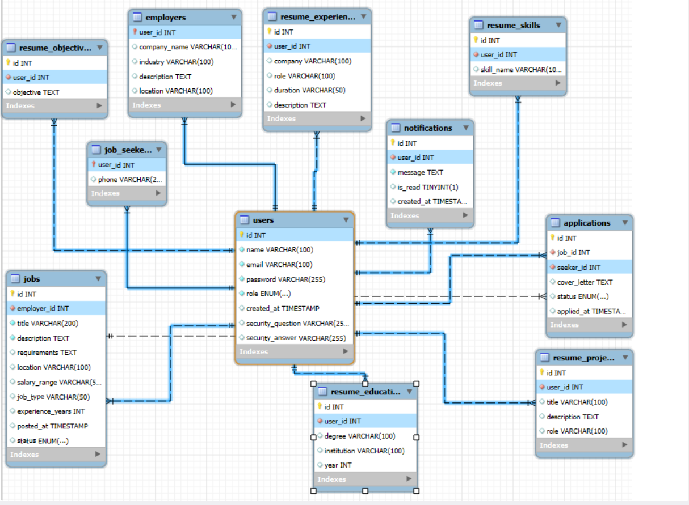

# RevHire Job Portal

RevHire is an enterprise-grade, console-based job portal application designed to connect jobseekers with employers. It features a robust architecture, a normalized database schema, and advanced security measures like password hashing.

---

## Project Architecture

The application follows a clean, layered architecture to ensure separation of concerns and maintainability:

1.  **Model Layer (`org.revhire.model`)**: Contains POJOs (Plain Old Java Objects) representing the core entities like `User`, `JobSeeker`, `Employer`, `Job`, `Application`, and detailed resume components (`Education`, `Experience`, etc.).
2.  **DAO Layer (`org.revhire.dao`)**: Handles all database interactions using JDBC. It utilizes a **shared static connection** pattern (per user request) with robust resource management via `try-with-resources`.
3.  **Service Layer (`org.revhire.service`)**: Contains the business logic. It coordinates between various DAOs and handles cross-functional concerns like notifications.
4.  **Controller Layer (`org.revhire.controller`)**: Manages the CLI user interface, collects user input, and translates it into service calls.
5.  **Config Layer (`org.revhire.config`)**: Handles database connection configuration.
6.  **Utility Layer (`org.revhire.util`)**: Contains helper classes like `PasswordUtils` for cross-cutting concerns.

---

##  Database Schema

The database (`revhire`) is designed with normalization in mind to handle complex resume structures and maintain data integrity.




### Core Tables:
-   **`users`**: The central table for authentication. Stores basic user info, roles, and security questions.
-   **`job_seekers`**: Stores seeker-specific metadata (e.g., phone).
-   **`employers`**: Stores employer/company details (industry, location, etc.).
-   **`jobs`**: Stores job postings with requirements, salary ranges, and status.
-   **`applications`**: Links seekers to jobs, storing cover letters and application status.
-   **`notifications`**: Stores in-app alerts for users.

### Normalized Resume Tables:
To avoid "blob" storage and allow for future searchability, the resume is decomposed into:
-   `resume_objectives`
-   `resume_education`
-   `resume_experience`
-   `resume_skills`
-   `resume_projects`

*Relationships*: All profile and resume tables use `user_id` as a foreign key with `ON DELETE CASCADE` to ensure data cleanliness.

---

##  Workflow

1.  **Authentication**: Users register as either a Seeker or an Employer.
2.  **Profile Setup**:
    -   **Seekers**: Guided through a multi-step prompt to enter their structured resume details (Education, Skills, etc.).
    -   **Employers**: Provide company name, industry, and description.
3.  **Job Lifecycle**:
    -   Employers post jobs.
    -   Seekers search for jobs using keywords, location, or type.
    -   Seekers apply for jobs with a cover letter.
4.  **Processing**:
    -   Employers view applicants and update application status (Shortlisted/Rejected).
5.  **Notifications**: Users receive real-time alerts when their application status changes or when new applicants apply to their jobs.

---

##  Password Hashing (Security)

Security is a top priority. We have implemented industry-standard password hashing to protect user credentials.

### How it's Implemented:

1.  **Dependency**: We use **jBCrypt**, a trusted implementation of the OpenBSD Blowfish password hashing algorithm.
    -   *Maven Import*:
        ```xml
        <dependency>
            <groupId>org.mindrot</groupId>
            <artifactId>jbcrypt</artifactId>
            <version>0.4</version>
        </dependency>
        ```

2.  **`PasswordUtils` Class**:
    -   Located in `org.revhire.util`.
    -   **`hashPassword(String)`**: Uses `BCrypt.hashpw` with a randomly generated salt (`BCrypt.gensalt()`). This ensures that even identical passwords result in different hashes.
    -   **`checkPassword(String, String)`**: Uses `BCrypt.checkpw` to safely verify a plain-text password against a stored hash. It is resistant to timing attacks.

3.  **End-to-End Flow**:
    -   **Registration**: When a user registers, the `AuthService` intercepts the plain-text password, hashes it using `PasswordUtils`, and *only* then passes the hash to `UserDAO` for database insertion.
    -   **Login**: During login, `UserDAO` fetches the stored hash. `AuthService` then uses `PasswordUtils.checkPassword` to verify the user's input. The plain-text password is never stored or logged.
    -   **Recovery**: When resetting a password via security questions, the new password is also hashed before being updated in the database.

---

##  Input Validation

The application performs robust server-side validation using `ValidationUtils`:
- **Email Validation**: Ensures emails follow a standard format (e.g., `Vishnu@gmail.com`).
- **Password Complexity**: Enforces high security standards:
    - Minimum 8 characters.
    - At least one uppercase and one lowercase letter.
    - At least one digit.
    - At least one special character (`@#$%^&+=!`).

---

##  Technical Stack

-   **Language**: Java 21 (LTS)
-   **Database**: MySQL 8+
-   **Build Tool**: Maven
-   **Logging**: SLF4J with Logback
-   **Testing**: JUnit 5, Mockito

---

##  How to Run

1.  Clone the repository.
2.  Run the `src/main/resources/db_schema.sql` script in your MySQL instance.
3.  Update `DBConnection.java` with your database credentials if necessary.
4.  Build using `mvn clean install`.
5.  Run the application via `org.revhire.Main`.
